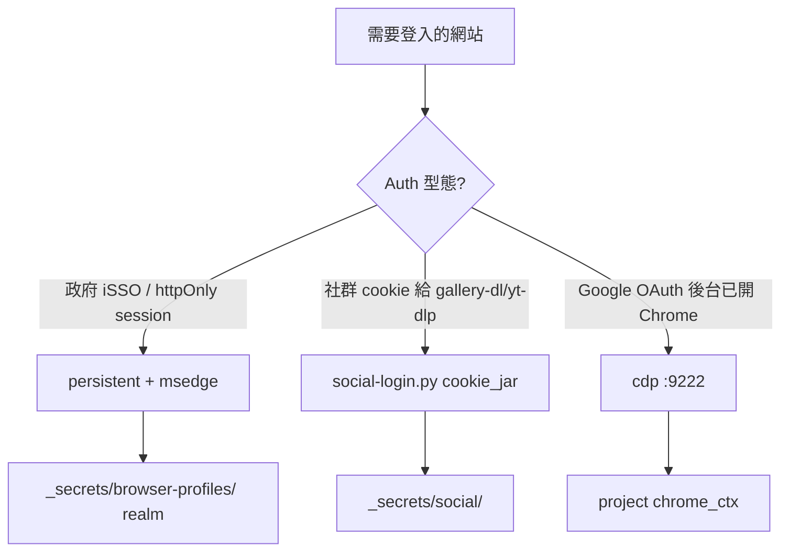

# sso-browser-session — 模組化瀏覽器 SSO（全 hub 共用）

> **父 skill（必讀）**：`ztm-web-auth-ops` — 任何網頁登入前先跑 `auth_check.py check`。

**CITE:** `auth-strategies-for-browsers.md` · `pywebview-login-flow.md` · `chrome-dpapi-cookies-2025.md`

## 一句話

| 場景 | 用什麼 | 瀏覽器 | Profile 放哪 |
|------|--------|--------|--------------|
| **政府 iSSO**（tpbusker、id.taipei） | **persistent** Strategy D | **Microsoft Edge** (`channel=msedge`) | `_secrets/browser-profiles/gov.isso.tpbusker/` |
| **社群爬蟲**（IG/X/FB） | **cookie_jar** → `social-login.py` | Chromium（Playwright 內建） | `_secrets/social/<platform>/cookies.txt` |
| **Google OAuth 後台**（LINE Console、GCP） | **cdp** Strategy E | **Chrome Profile 3**（scss1199） | `_secrets/jci_taipei/.browser_session` 或 `:9222` |

**禁止：** 讀取 operator 日常 Edge/Chrome User Data（Win11 DPAPI + profile lock）。  
**禁止：** 未確認 session 就背景彈登入窗（見 `no-proactive-auth-popups.md`）。

---

## ai_busker（tpbusker）— 推薦方案

### 瀏覽器

**Microsoft Edge** — operator 已用 Edge 登入；Playwright `channel="msedge"` 與 WebView2 / 政府站相容性最佳。

### Profile

**專用 automation profile**（不是 `%LOCALAPPDATA%\Microsoft\Edge\User Data`）：

```text
%AI_WORKSPACE%\_secrets\browser-profiles\gov.isso.tpbusker\
```

- 第一次 `seed` 時 headful 完成 iSSO（台北通 / 手機電信 / 憑證）
- 之後 HubClock / `lottery_run.py` headless 重用同一 profile 的 httpOnly cookie
- session 過期 → **notify → operator 再 seed**（不 silent 彈窗）

### Realm SSOT

`_registry/sso-realms.json` → `gov.isso.tpbusker`

### 指令

```powershell
# 1) 首次登入（開 Edge 視窗，你完成 iSSO）
python %AI_WORKSPACE%\_skill\engines\sso_browser.py seed gov.isso.tpbusker

# 2) 確認 session 仍有效
python %AI_WORKSPACE%\_skill\engines\sso_browser.py check gov.isso.tpbusker

# 3) 在有效 session 下跑專案腳本
python %AI_WORKSPACE%\_skill\engines\sso_browser.py with gov.isso.tpbusker -- python %AI_WORKSPACE%\ai_busker\scripts\lottery_run.py --confirm
```

環境變數（子程序）：

- `SSO_BROWSER_REALM`
- `SSO_BROWSER_PROFILE`
- `SSO_BROWSER_OK_URL`

---

## 與其他 seat 對齊

| Seat | 現狀 | 統一後 |
|------|------|--------|
| **ai_busker** | tpbusker iSSO | `gov.isso.tpbusker` persistent **Edge** |
| **ai_metadata** | `social-login.py` Playwright | registry `social.*` → delegate，不 rewrite |
| **jci_taipei** | `chrome_ctx.py` CDP :9222 + Profile 3 | registry `jci.line.console`；長期可遷到 `browser-profiles/` |
| **ai_demo** | auth-once storageState | 新 SPA 仍可用 `seed` + persistent；storageState 匯出為 P2 |

---

## 新增 realm（任何 project）

1. 編輯 `_registry/sso-realms.json`（PR / SUBMIT）
2. `mode`: `persistent` | `cookie_jar` | `cdp`
3. `validate.logged_in_url_contains` / `logged_out_url_contains` — **必填**（防 guest session 假陽性）
4. `python sso_browser.py seed <realm>` 實測
5. SUBMIT `_inbox/from_projects/<project>/sso-realm-<name>.md`

---

## Playwright 安裝（一次性）

```powershell
pip install playwright
playwright install msedge
```

---

## 決策樹（精簡）



---

## 相關 KB（curator 已收錄）

- `50-techniques/auth-strategies-for-browsers.md` — Strategy A–E
- `50-techniques/pywebview-login-flow.md` — WebView2 fallback
- `70-pitfalls/chrome-dpapi-cookies-2025.md` — 為何不能 export Chrome cookie

**Index 待 curator 加一行：** `sso-browser-session` → 本 skill + `sso_browser.py`
